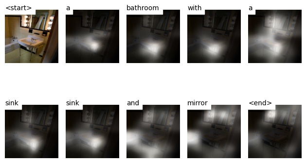
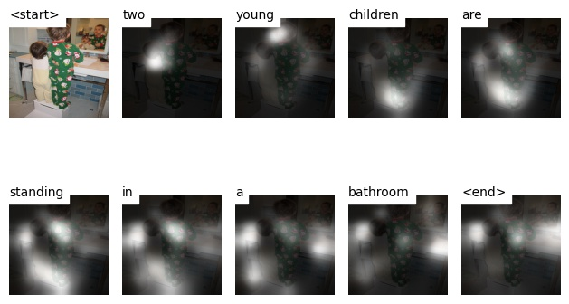
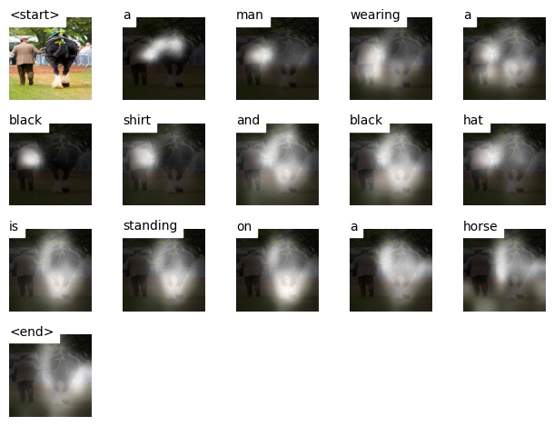
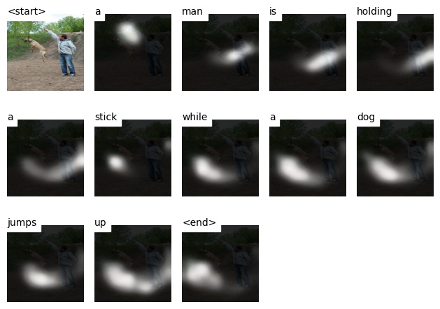

## Introduction
This repository contains code for the paper "Show, Attend and Tell" published in ICML 2015.

TODO

## Implementation Details
TODO
## Results
TODO
## Demo
TODO

## Learning Outcomes
TODO
## References
[1] https://github.com/sgrvinod/a-PyTorch-Tutorial-to-Image-Captioning  
[2] https://github.com/DeepRNN/image_captioning